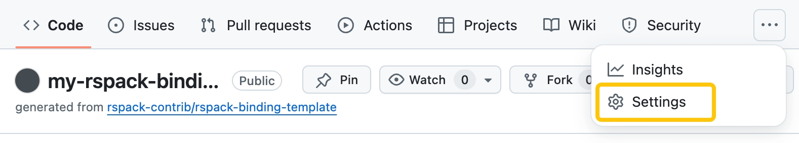
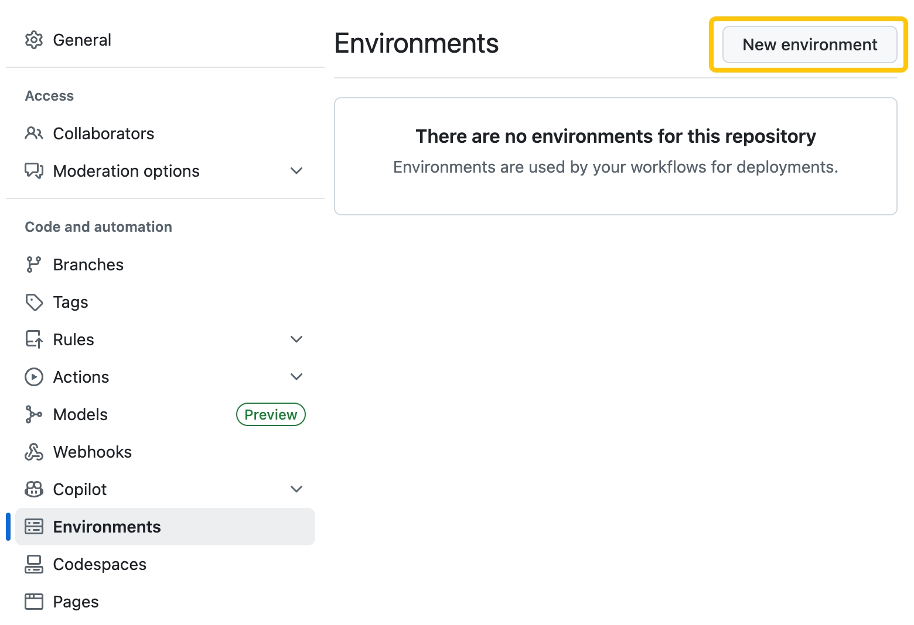
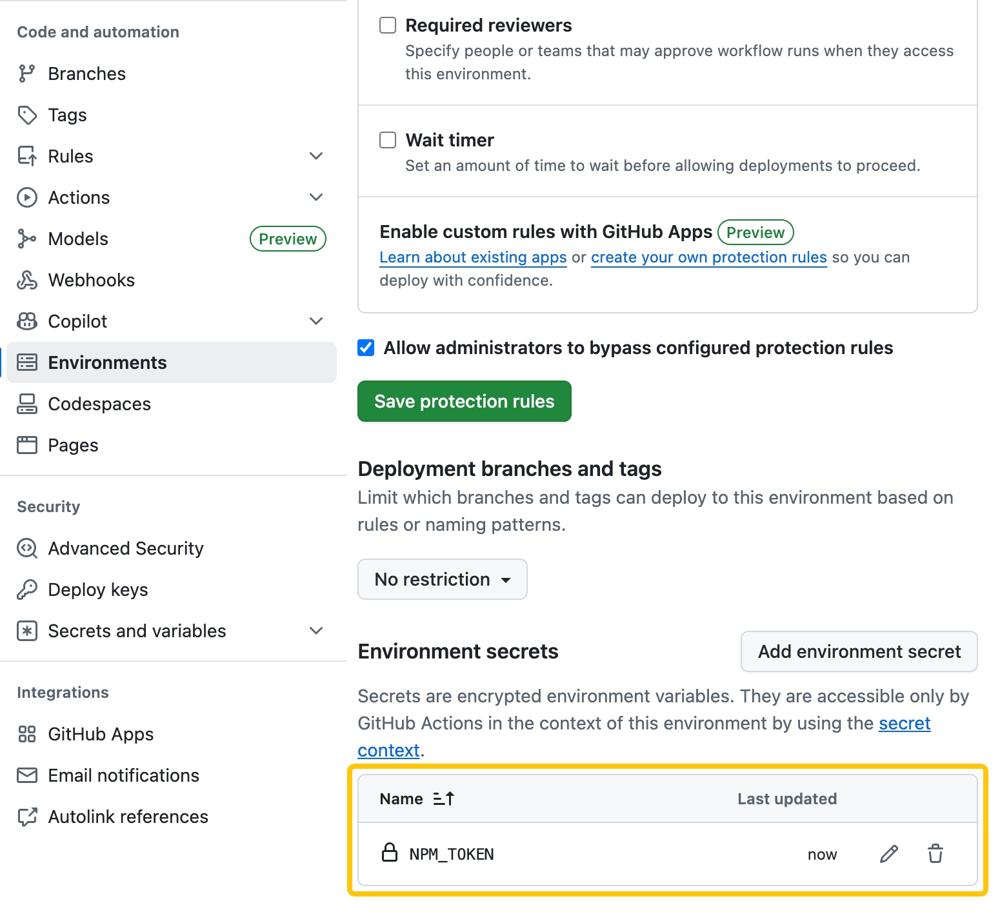
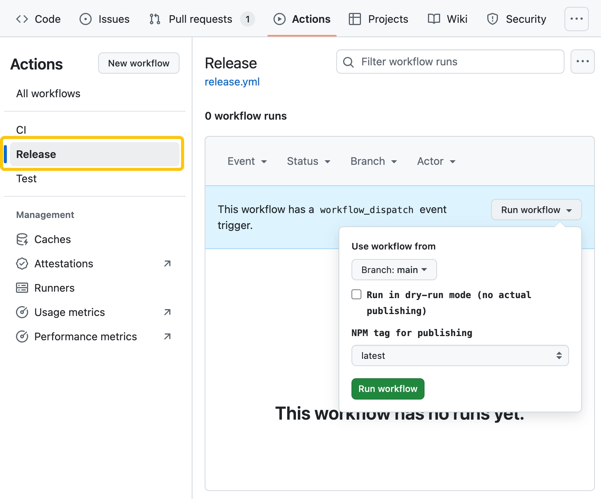
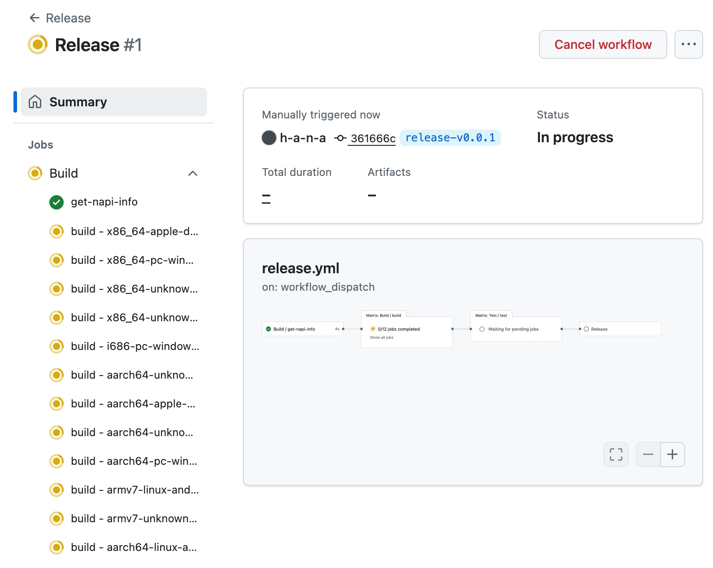

# Releasing

This chapter covers releasing your plugin to npm using GitHub Actions. The template includes a complete [release workflow](https://github.com/rspack-contrib/rspack-binding-template/blob/main/.github/workflows/release.yml) that handles building, testing, and publishing automatically.

## Release workflow

### Prerequisites

Before releasing, ensure you have completed these requirements:

#### 1. Update Repository Information

You **must** update the repository URLs in your `package.json` files to match your actual repository, otherwise you'll encounter a sigstore provenance verification error during publishing:

```text
npm error 422 Unprocessable Entity - PUT https://registry.npmjs.org/@your-scope%2fyour-package-darwin-x64
Error verifying sigstore provenance bundle: Failed to validate repository information:
package.json: "repository.url" is "git+https://github.com/rspack-contrib/rspack-binding-template.git",
expected to match "https://github.com/your-username/your-repository" from provenance
```

Update the following files:

- `package.json` - Update the `repository.url`, `bugs.url`, and `homepage` fields
- `crates/binding/package.json` - Update the `repository.url`, `bugs.url`, and `homepage` fields

For example, change:

```json
{
  "repository": {
    "type": "git",
    "url": "git+https://github.com/rspack-contrib/rspack-binding-template.git"
  },
  "bugs": {
    "url": "https://github.com/rspack-contrib/rspack-binding-template/issues"
  },
  "homepage": "https://github.com/rspack-contrib/rspack-binding-template#readme"
}
```

To:

```json
{
  "repository": {
    "type": "git",
    "url": "git+https://github.com/your-username/your-repository.git"
  },
  "bugs": {
    "url": "https://github.com/your-username/your-repository/issues"
  },
  "homepage": "https://github.com/your-username/your-repository#readme"
}
```

#### 2. Configure NPM Token

The release workflow requires an [_Environment secret_](https://docs.github.com/en/actions/how-tos/writing-workflows/choosing-what-your-workflow-does/using-secrets-in-github-actions#creating-secrets-for-an-environment) with `NPM_TOKEN` to be set in the repository settings:

1. On GitHub, navigate to the main page of the repository.

2. Under your repository name, click Settings. If you cannot see the "Settings" tab, select the dropdown menu, then click Settings.



3. In the left sidebar, click Environments.

4. Click "New environment" to add a new environment.



5. Type `npm` as the name for the environment.

6. Click "Add environment secret".

7. Enter the name for your secret as "NPM_TOKEN".

8. Enter the value for your secret.

   > **Note:** If you don't have a token, you can follow this guide to [create a new token](https://docs.npmjs.com/creating-and-viewing-access-tokens/).
   >
   > If you're using "Granular Access Token", make sure to select the "Read and write" scope and select "Only select packages and scopes" and select the scope for the package you want to publish (e.g. `@rspack-template`).

9. Click Add secret.



### 1. Create a releasing branch

To release a new version, you need to create a new branch. You can use any branch name you want, but it's recommended to use a name that indicates the version you're releasing.

For example, if you're releasing version `0.0.1`, you can create a branch named `release-v0.0.1`.

```bash
git checkout -b release-v0.0.1
```

### 2. Trigger a version bump

Before releasing, you need to bump the versions in both `package.json` and `crates/binding/package.json`.

rspack-binding-template does not come with any version bump tool. You can either manually bump the versions in both `package.json`s or setup any version bump tool.

For example: [PR: chore: release v0.0.1](https://github.com/h-a-n-a/my-rspack-binding/pull/1)

### 3. Trigger the release workflow

1. Navigate to **Actions** → **Release** in your repository
2. Click **Run workflow**
3. Configure options:
   - **Use workflow from**: Select the branch you want to release from. (In this case, it's `release-v0.0.1`)
   - **Dry-run mode**: Test without publishing
   - **NPM tag**: Choose `latest`, `alpha`, `beta`, or `canary`
4. Click **Run workflow** button in the popover.



The workflow will be triggered and you can see the progress in the **Actions** tab.

For example: [Release v0.0.1](https://github.com/h-a-n-a/my-rspack-binding/actions/runs/16519440059)



## Deep Dive into the Workflow

The workflow consists of three sequential jobs:

### 1. Build

Compiles the Node.js addon for all supported targets using the [rspack-toolchain build workflow](https://github.com/rspack-contrib/rspack-toolchain/blob/main/.github/workflows/build.yml). The build uses the release profile for optimal performance:

```toml
[profile.release]
codegen-units = 1
debug = false
lto = "fat"
opt-level = 3
panic = "abort"
strip = true
```

### 2. Test

Validates the built bindings using the test suite to ensure everything works correctly before publishing.

### 3. Release

Publishes the packages to npm registry:

1. **Environment Setup**: Configures Node.js 22, pnpm, and dependency caching
2. **Artifact Processing**: Downloads compiled bindings and organizes them into platform-specific npm packages using `pnpm napi create-npm-dirs` and `pnpm napi artifacts`
3. **Package Preparation**: Configures npm authentication and runs `pnpm napi pre-publish` to prepare platform packages
4. **Publishing**: Uses `pnpm publish -r` to publish all packages with the specified tag

## Package Provenance

All packages published through this workflow include [npm provenance](https://docs.npmjs.com/generating-provenance-statements#about-npm-provenance) statements, which enhance supply-chain security by:

- **Provenance attestation**: Publicly links packages to their source code and build instructions, allowing developers to verify where and how packages were built
- **Publish attestation**: Generated by npm registry when packages are published by authorized users

The workflow automatically enables provenance using the `--provenance` flag. Packages are signed by [Sigstore](https://docs.npmjs.com/generating-provenance-statements#about-sigstore) public servers and logged in a public transparency ledger, providing verifiable proof of the package's origin and build process.

## Supported Targets

The workflow builds for these targets:

```text
x86_64-apple-darwin
x86_64-pc-windows-msvc
x86_64-unknown-linux-gnu
x86_64-unknown-linux-musl
i686-pc-windows-msvc
aarch64-unknown-linux-gnu
aarch64-apple-darwin
aarch64-unknown-linux-musl
aarch64-pc-windows-msvc
armv7-linux-androideabi
armv7-unknown-linux-gnueabihf
aarch64-linux-android
```

For the complete list, see [rspack-toolchain supported targets](https://github.com/rspack-contrib/rspack-toolchain?tab=readme-ov-file#supported-targets).

## Manual Release

To trigger a release:

1. Navigate to **Actions** → **Release** in your repository
2. Click **Run workflow**
3. Configure options:
   - **Dry-run mode**: Test without publishing (recommended first)
   - **NPM tag**: Choose `latest`, `alpha`, `beta`, or `canary`

The workflow will automatically build, test, and publish your plugin packages to npm, making them available for installation.
