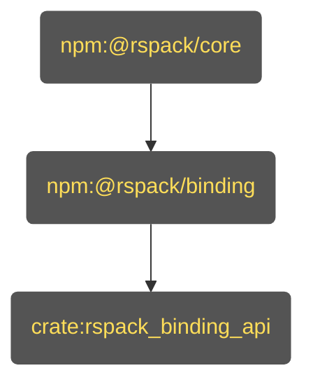
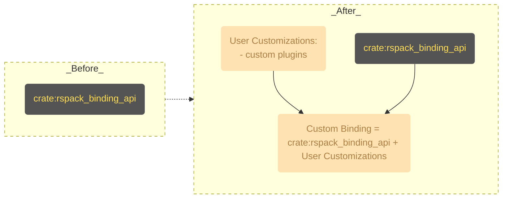

# Getting Started

To get started with _Rspack Custom Binding_, you need to know the surface level of how Rspack binding works.

## How Rspack Binding Works

This is the binding architecture of Rspack.

If you are using the `@rspack/cli` or `@rspack/core` and not knowing what a _custom binding_ is, you are using this. It's a simple architecture that allows you to extend Rspack's functionality by leveraging the [Rspack JavaScript API](https://rspack.rs/api/index.html). It's just the same as how you use the [webpack JavaScript API](https://webpack.js.org/api/) to extend webpack.

Let's take a deep dive into the architecture. It contains 3 parts:

- `npm:@rspack/core`: The JavaScript API layer of Rspack. Written in JavaScript.
- `npm:@rspack/binding`: The _Node.js Addon_ of Rspack.
- `crate:rspack_binding_api`: The _N-API_ glue layer of Rspack. Written in Rust.

### [`crate:rspack_binding_api`](https://github.com/web-infra-dev/rspack/tree/main/crates/rspack_binding_api)

The _N-API_ glue layer of Rspack.

This layer contains a glue code that bridges the gap between _N-API_-compatible runtimes, which, most of the time, is [Node.js](https://nodejs.org) and [Rust Core crates](https://github.com/web-infra-dev/rspack/tree/main/crates).

It compiles to the _Node.js Addon_ (`*.node` file) located in `npm:@rspack/binding` and loaded by `npm:@rspack/binding`. The functionalities that `npm:@rspack/binding` provides are mostly implemented in `crate:rspack_binding_api`.

### [`npm:@rspack/binding`](https://github.com/web-infra-dev/rspack/tree/main/crates/node_binding)

The _Node.js Addon_ of Rspack.

This layer contains the compiled glue layer of `crate:rspack_binding_api` with [NAPI-RS](https://github.com/napi-rs/napi-rs). The functionalities that `npm:@rspack/core` provides are mostly exposed by the _Node.js Addon_ in `npm:@rspack/binding`.

Note: Maybe you have checked out the code on [npm](https://www.npmjs.com/package/@rspack/binding?activeTab=code) and it does not contain the `*.node` file. This is because the `*.node` files are dispatched by the `@rspack/binding-*` packages (e.g. `@rspack/binding-darwin-arm64`) for different platforms. Don't worry about this at the moment. We will get into the details in the custom binding section.

### [`npm:@rspack/core`](https://github.com/web-infra-dev/rspack/tree/main/packages/rspack)

The JavaScript API layer of Rspack.

The internal of `npm:@rspack/core` is written in JavaScript. It bridges the gap between the _Node.js Addon_ in `npm:@rspack/binding` and [Rspack JavaScript API](https://rspack.rs/api/index.html).

`npm:@rspack/cli` is a command line tool that uses `npm:@rspack/core` to build your project.

## How Rspack _Custom Binding_ Works

