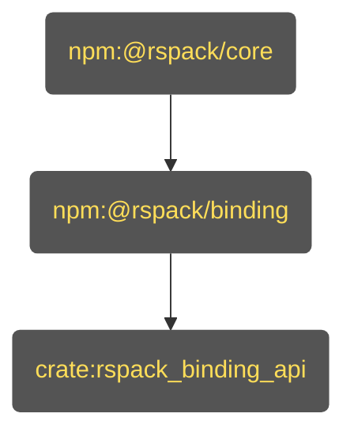
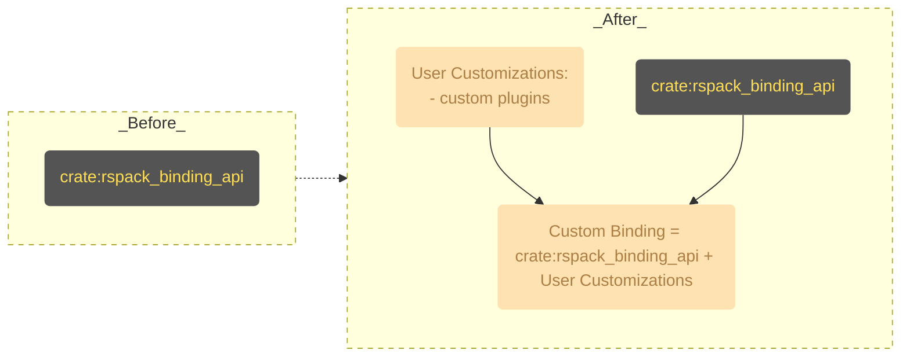

# Rationale of _Rspack Custom Binding_

The reason why Rspack is so fast is that it's written in Rust and so as the Rspack's internal builtin plugins and builtin loaders.

For most of the time, I assume you've been using [Rspack JavaScript API](https://rspack.rs/api/index.html) and writing [Rspack JavaScript Plugins](https://rspack.rs/api/plugin-api). And you might probably heard there're some overheads when using JavaScript API. The rumour is true! Rspack is mostly written in Rust and providing the adapting layer with JavaScript API requires a lot of hassle of passing values back and forth between Rust and JavaScript. This creates a lot of overheads and performance issues.

But have you ever wondered if there's a way to extend Rspack's functionality by writing native Rust code and not requiring to sacrifice the performance or if you're able to use the rich Rust APIs? And the answer is yes. This is where _Rspack Custom Binding_ comes in.

To get started with _Rspack Custom Binding_, you need to know the surface level of how _Rspack binding_ works.

## How _Rspack Binding_ Works

If you are using the `@rspack/cli` or `@rspack/core` and not knowing what a _custom binding_ is, you are using _Rspack binding_. It's a simple architecture that allows you to extend Rspack's functionality by leveraging the [Rspack JavaScript API](https://rspack.rs/api/index.html). It's just the same as how you use the [Webpack JavaScript API](https://webpack.js.org/api/) to extend Webpack.

Let's take a deep dive into the architecture. It contains 3 parts:

- `npm:@rspack/core`: The JavaScript API layer of Rspack. Written in JavaScript.
- `npm:@rspack/binding`: The _Node.js Addon_ of Rspack.
- `crate:rspack_binding_api`: The _N-API_ glue layer of Rspack. Written in Rust.

### [`crate:rspack_binding_api`](https://github.com/web-infra-dev/rspack/tree/main/crates/rspack_binding_api)

The _N-API_ glue layer of Rspack.

This layer contains a glue code that bridges the gap between _N-API_-compatible runtimes, which, most of the time, is [Node.js](https://nodejs.org) and [Rust Core crates](https://github.com/web-infra-dev/rspack/tree/main/crates).

### [`npm:@rspack/binding`](https://github.com/web-infra-dev/rspack/tree/main/crates/node_binding)

The _Node.js Addon_ of Rspack.

This layer links `crate:rspack_binding_api` and compiles it into a _Node.js Addon_ (a `*.node` file) with [NAPI-RS](https://github.com/napi-rs/napi-rs). The functionalities that `npm:@rspack/core` provides are mostly exposed by the _Node.js Addon_ in `npm:@rspack/binding`.

Note: Maybe you have checked out the code on [npm](https://www.npmjs.com/package/@rspack/binding?activeTab=code) and it does not contain the `*.node` file. This is because the `*.node` files are dispatched by the `@rspack/binding-*` packages (e.g. `@rspack/binding-darwin-arm64`) for different platforms. Don't worry about this at the moment. We will get into the details in the custom binding section.

### [`npm:@rspack/core`](https://github.com/web-infra-dev/rspack/tree/main/packages/rspack)

The JavaScript API layer of Rspack.

The internal of `npm:@rspack/core` is written in JavaScript. It bridges the gap between the _Node.js Addon_ in `npm:@rspack/binding` and [Rspack JavaScript API](https://rspack.rs/api/index.html).

`npm:@rspack/cli` is a command line tool that uses `npm:@rspack/core` to build your project.

## How _Rspack Custom Binding_ Works

Let's use the diagram below to understand how a _custom binding_ works. It shows a "_Before_" state, representing the standard Rspack setup, and an "_After_" state, which illustrates the _custom binding_ approach.

In the **_Before_** state, your project uses the default _Rspack binding_. This is created solely from `crate:rspack_binding_api`, the core glue layer between Rust and Node.js.

In the **_After_** state, you introduce your own native code. As the diagram shows, your **User Customizations** (like custom Rust plugins) are combined with the original `crate:rspack_binding_api`.

This combination produces a new, personalized **Custom Binding**. This becomes your project's new Node.js addon, allowing you to inject high-performance, custom logic directly into Rspack's build process.

Crucially, you can continue to use [`npm:@rspack/core`](#npmrspackcore) with your custom binding. This allows you to benefit from native performance and customization without rewriting the JavaScript API layer, reusing all the features it provides. We will cover how to integrate `@rspack/core` with a custom binding in a later section.

