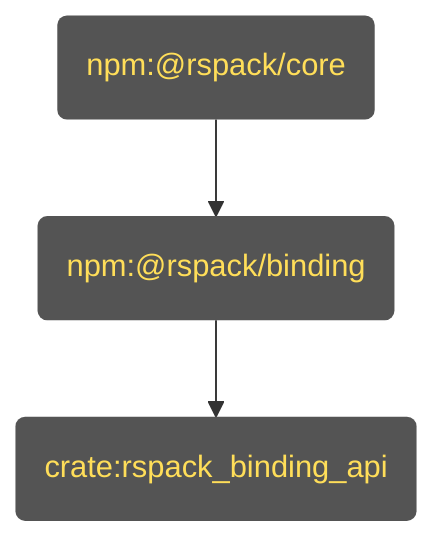
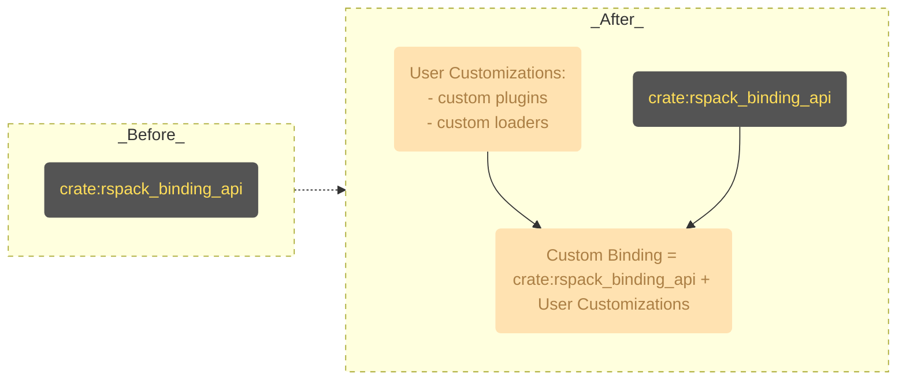

# Rationale of _Rspack Custom Binding_

Rspack is so fast because it's written in Rust, along with Rspack's internal built-in plugins and built-in loaders.

Most of the time, we assume you've been using the [Rspack JavaScript API](https://rspack.rs/api/index.html) and writing [Rspack JavaScript Plugins](https://rspack.rs/api/plugin-api).

You might have heard there are some overheads when using the JavaScript API. The rumor is true!

Since Rspack is mostly written in Rust, providing the adaptation layer with the JavaScript API requires significant overhead. This overhead comes from:

- Passing values back and forth between Rust and JavaScript
- Type conversions between languages
- Memory allocation and deallocation

These factors create performance bottlenecks.

But have you ever wondered if there's a way to extend Rspack's functionality by writing native Rust code? A way that:

- Doesn't sacrifice performance
- Provides access to rich Rust APIs
- Avoids JavaScript-Rust overhead

The answer is yes. This is where _Rspack Custom Binding_ comes in.

To get started with _Rspack Custom Binding_, you need to know the surface level of how _Rspack binding_ works.

## How _Rspack Binding_ Works

If you are using `@rspack/cli` or `@rspack/core` without knowing what a _custom binding_ is, you are using _Rspack binding_.

It's a simple architecture that allows you to extend Rspack's functionality by leveraging the [Rspack JavaScript API](https://rspack.rs/api/index.html). This works the same way you use the [Webpack JavaScript API](https://webpack.js.org/api/) to extend Webpack.

Let's take a deep dive into the architecture. It contains 3 parts:

- `npm:@rspack/core`: The JavaScript API layer of Rspack. Written in JavaScript.
- `npm:@rspack/binding`: The _Node.js Addon_ of Rspack.
- `crate:rspack_binding_api`: The _N-API_ glue layer of Rspack. Written in Rust.

### [`crate:rspack_binding_api`](https://github.com/web-infra-dev/rspack/tree/main/crates/rspack_binding_api)

The _N-API_ glue layer of Rspack.

This layer contains glue code that bridges the gap between _N-API_-compatible runtimes (typically [Node.js](https://nodejs.org)) and [Rust Core crates](https://github.com/web-infra-dev/rspack/tree/main/crates).

### [`npm:@rspack/binding`](https://github.com/web-infra-dev/rspack/tree/main/crates/node_binding)

The _Node.js Addon_ of Rspack.

This layer performs two key functions:

1. Links `crate:rspack_binding_api`
2. Compiles it into a _Node.js Addon_ (a `*.node` file) with [NAPI-RS](https://github.com/napi-rs/napi-rs)

The functionalities that `npm:@rspack/core` provides are mostly exposed by the _Node.js Addon_ in `npm:@rspack/binding`.

**Note**: If you've checked the code on [npm](https://www.npmjs.com/package/@rspack/binding?activeTab=code), you'll notice it doesn't contain the `*.node` file.

This is because the `*.node` files are distributed by platform-specific packages:
- `@rspack/binding-darwin-arm64` (for macOS ARM)
- `@rspack/binding-linux-x64` (for Linux x64)
- And others for different platforms

Don't worry about this for now—we'll cover the details in the custom binding section.

### [`npm:@rspack/core`](https://github.com/web-infra-dev/rspack/tree/main/packages/rspack)

The JavaScript API layer of Rspack.

The internals of `npm:@rspack/core` are written in JavaScript. It bridges the gap between the _Node.js Addon_ in `npm:@rspack/binding` and the [Rspack JavaScript API](https://rspack.rs/api/index.html).

`npm:@rspack/cli` is a command line tool that uses `npm:@rspack/core` to build your project.

## How _Rspack Custom Binding_ Works

Let's use the diagram below to understand how a _custom binding_ works. The diagram shows two states:

- **"_Before_"**: The standard Rspack setup
- **"_After_"**: The _custom binding_ approach

### Before State
Your project uses the default _Rspack binding_. This is created solely from `crate:rspack_binding_api`, the core glue layer between Rust and Node.js.

### After State
You introduce your own native code. As the diagram shows, your **User Customizations** (like custom Rust plugins and loaders) are combined with the original `crate:rspack_binding_api`.

This combination produces a new, personalized **Custom Binding** with several benefits:
- Becomes your project's new Node.js addon
- Allows injecting high-performance, custom logic directly into Rspack's build process
- Eliminates JavaScript-Rust communication overhead for your custom code

### Key Advantage
You can continue to use [`npm:@rspack/core`](#npmrspackcore) with your custom binding. This approach provides:

- **Native performance and customization**: Your code runs at Rust speed
- **No API rewriting needed**: Keep using the existing JavaScript API layer
- **Feature reuse**: Access all features that `@rspack/core` provides

We will cover how to integrate `@rspack/core` with a custom binding in a later section.

## Next Steps

Now you have a basic understanding of how _Rspack Custom Binding_ works. Let's move on to the [Create From Template](./create-from-template.md) guide to set up your development environment.
